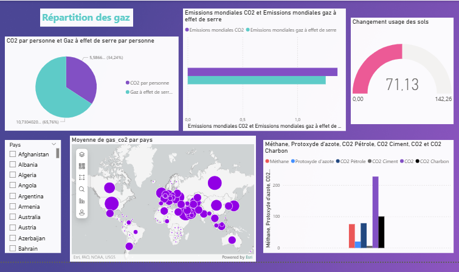
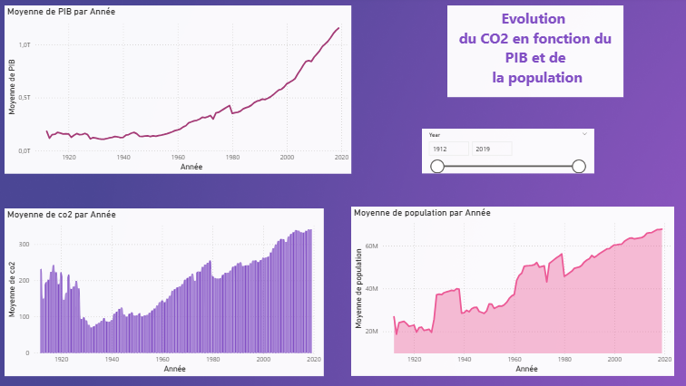

# GHG-Emissions-Dashboard

# 🌍 Dashboard Power BI – Émissions de Gaz à Effet de Serre (GES)

Ce projet propose une visualisation interactive des émissions de gaz à effet de serre (GES) dans le monde à l’aide de Power BI. L’objectif est de rendre accessibles des données climatiques à travers des graphiques clairs, comparatifs et dynamiques.

## 📊 Aperçu du projet

Le tableau de bord Power BI permet d’explorer :

- Les émissions de GES par **pays** 🌐  
- L’évolution des émissions de **CO₂ sur plusieurs années** 📈  
- La **comparaison entre régions et continents** 🗺️  
- Le lien entre **émissions de CO₂, PIB et population** 📊  

## 🔍 Données utilisées

Les principales données utilisées dans ce projet proviennent de **Our World in Data**, publiées sous licence [Creative Commons Attribution 4.0 International (CC BY 4.0)](https://creativecommons.org/licenses/by/4.0/).

Les auteurs originaux de cette base de données sont :

- Hannah Ritchie, Max Roser, Edouard Mathieu, Bobbie Macdonald, Pablo Rosado

🔗 Source : [Our World in Data – CO₂ and Greenhouse Gas Emissions](https://ourworldindata.org/co2-and-other-greenhouse-gas-emissions)

> 📌 **Note importante** : Les visualisations, données et codes produits par *Our World in Data* sont en libre accès sous licence CC BY 4.0. Certaines données proviennent de sources tierces et conservent leur propre licence. Merci de toujours vérifier la licence de chaque source avant réutilisation.

## 📦 Contenu du dépôt

Voici la structure des dossiers et fichiers dans ce projet :
  
- 📁 `powerbi` : Fichier Power BI (.pbix)  
- 📁 `screenshots` : Captures d’écran du dashboard  
- 📄 `README.md` : Ce fichier  
- 📄 `LICENSE` : Licence d’utilisation (CC BY-NC-SA 4.0)

## ▶️ Prévisualisation

### Répartition des gaz à effet de serre


### Évolution temporelle du CO₂



> 💡 Si vous ne voyez pas l’image, ouvrez le fichier `.pbix` avec Power BI Desktop.

## 🚀 Utilisation

1. Cloner le dépôt :  
   ```bash
   git clone https://github.com/tonpseudo/EmissionsGES-PowerBI.git
   ```
2. Ouvrir le fichier `.pbix` avec [Power BI Desktop](https://powerbi.microsoft.com/)  
3. Naviguer entre les pages pour explorer les données

## 📄 Licence

Ce projet (code, visualisations Power BI et documentation) est distribué sous la licence  
**Creative Commons Attribution - NonCommercial - ShareAlike 4.0 International (CC BY-NC-SA 4.0)**.

Vous êtes libre de :

- **Partager** – copier, redistribuer ce projet sur tout support  
- **Adapter** – modifier, transformer, créer à partir de ce projet

À condition de :

- **Attribution** – vous devez créditer l’auteur original  
- **Pas d’usage commercial** – vous ne pouvez pas utiliser ce projet à des fins commerciales  
- **Partage dans les mêmes conditions** – toute contribution dérivée doit être sous la même licence

🔗 [Détails de la licence](https://creativecommons.org/licenses/by-nc-sa/4.0/)

---

© 2025 Louise-dbg — Ce projet est distribué selon les termes de la licence Creative Commons BY-NC-SA 4.0.
